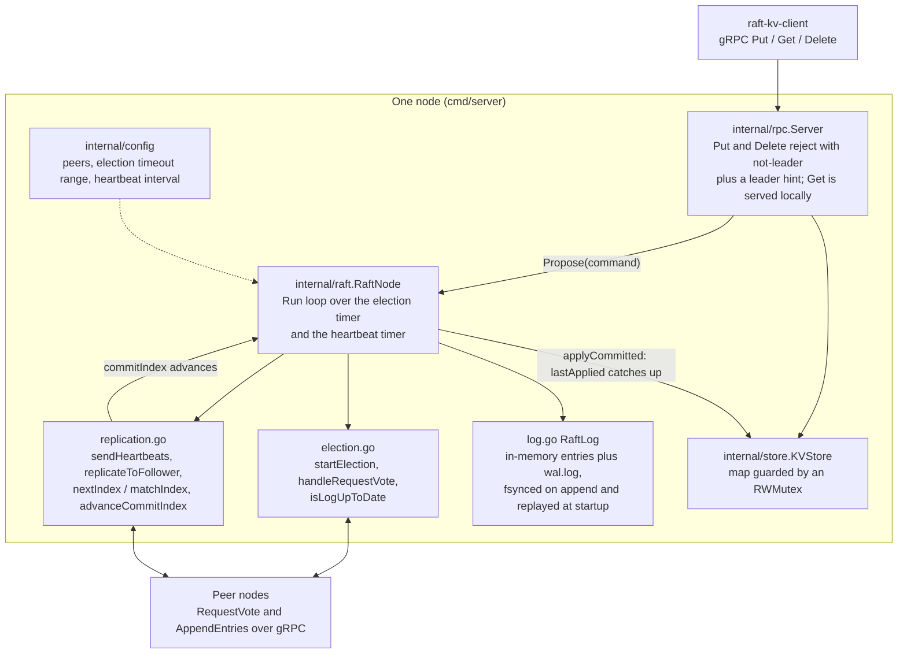
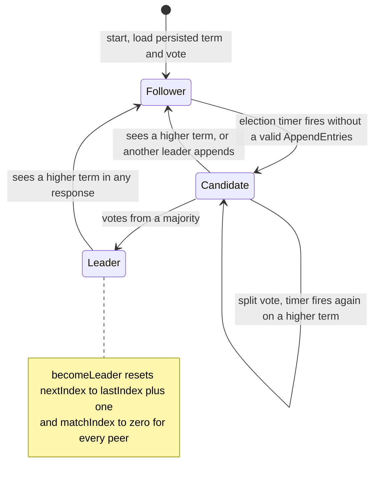

# Raft KV Store

A distributed key-value store built from scratch in Go with a custom Raft consensus implementation. Supports leader election, log replication, fault tolerance, and a gRPC API for client operations.

## Architecture



### Roles and transitions



### Election and replication over time



**How Raft works (briefly):**

Raft is a consensus algorithm that ensures a cluster of nodes agrees on a sequence of commands, even when some nodes fail. One node is elected **leader** and handles all writes. The leader replicates log entries to **followers** and commits them once a majority acknowledges. If the leader fails, a new election picks a replacement. This guarantees that committed data is never lost as long as a majority of nodes are alive.

## Prerequisites

- Go 1.22+
- Docker and Docker Compose (for multi-node cluster)

## Building

```bash
# Build server and client binaries
go build -o bin/raft-kv-server ./cmd/server
go build -o bin/raft-kv-client ./cmd/client
```

## Running

### Single node (development)

```bash
./bin/raft-kv-server \
  --id node1 \
  --addr 0.0.0.0:50051 \
  --data-dir /tmp/raft-kv/node1
```

### 3-node local cluster (without Docker)

Terminal 1:
```bash
./bin/raft-kv-server --id node1 --addr 0.0.0.0:50051 \
  --peers "node2=localhost:50052,node3=localhost:50053" \
  --data-dir /tmp/raft-kv/node1
```

Terminal 2:
```bash
./bin/raft-kv-server --id node2 --addr 0.0.0.0:50052 \
  --peers "node1=localhost:50051,node3=localhost:50053" \
  --data-dir /tmp/raft-kv/node2
```

Terminal 3:
```bash
./bin/raft-kv-server --id node3 --addr 0.0.0.0:50053 \
  --peers "node1=localhost:50051,node2=localhost:50052" \
  --data-dir /tmp/raft-kv/node3
```

### 3-node cluster with Docker Compose

```bash
cd deploy/docker
docker compose up --build
```

This starts 3 nodes exposed on ports 50051, 50052, and 50053.

## Using the CLI Client

```bash
# Put a key-value pair (auto-follows leader redirects)
./bin/raft-kv-client --server localhost:50051 put mykey myvalue

# Get a value
./bin/raft-kv-client --server localhost:50051 get mykey

# Delete a key
./bin/raft-kv-client --server localhost:50051 delete mykey
```

If the client connects to a follower for a write, the server responds with a leader hint and the client automatically retries against the leader.

## Simulating Network Partitions

With Docker Compose running:

```bash
# Isolate node1 (if it's leader, a new election will occur)
./scripts/partition.sh isolate raft-node1

# Reconnect node1
./scripts/partition.sh heal raft-node1
```

## Tests

```bash
# Run all unit tests
go test ./...

# With race detector
go test -race ./internal/raft/... ./internal/store/...

# Verbose output for a single package
go test -v ./internal/raft
```

End-to-end smoke test against a 3-node Compose cluster:

```bash
cd deploy/docker && docker compose up -d --build
./bin/raft-kv-client --server localhost:50051 put hello world
./bin/raft-kv-client --server localhost:50052 get hello   # follower read; should return "world" once replicated
./scripts/partition.sh isolate raft-node1                  # force re-election if node1 was leader
./bin/raft-kv-client --server localhost:50052 put k2 v2    # client should be redirected to the new leader
./scripts/partition.sh heal raft-node1
```

## Benchmarking

```bash
# Run against local cluster (default 1000 keys)
./scripts/bench.sh localhost:50051 1000
```

## Consistency Guarantees

- **Writes** are linearizable: a write is acknowledged only after the leader replicates it to a majority and commits it.
- **Reads** are served from any node's local state (eventual consistency). For strict linearizable reads, connect to the leader.
- **Leader election safety**: at most one leader per term. A candidate must have a log at least as up-to-date as a majority to win.
- **Log matching**: if two logs contain an entry with the same index and term, all preceding entries are identical.
- **Commit rule**: the leader only commits entries from its current term by counting replicas; entries from previous terms are committed indirectly.

## Configuration

All settings can be passed as flags or environment variables:

| Flag | Env Var | Default | Description |
|------|---------|---------|-------------|
| `--id` | `RAFT_NODE_ID` | `node1` | Unique node identifier |
| `--addr` | `RAFT_LISTEN_ADDR` | `0.0.0.0:50051` | gRPC listen address |
| `--peers` | `RAFT_PEERS` | (none) | Comma-separated `id=addr` pairs |
| `--data-dir` | `RAFT_DATA_DIR` | `/tmp/raft-kv` | Directory for WAL and state |
| `--election-min` | `RAFT_ELECTION_TIMEOUT_MIN` | `150` | Min election timeout (ms) |
| `--election-max` | `RAFT_ELECTION_TIMEOUT_MAX` | `300` | Max election timeout (ms) |
| `--heartbeat` | `RAFT_HEARTBEAT_INTERVAL` | `50` | Heartbeat interval (ms) |
